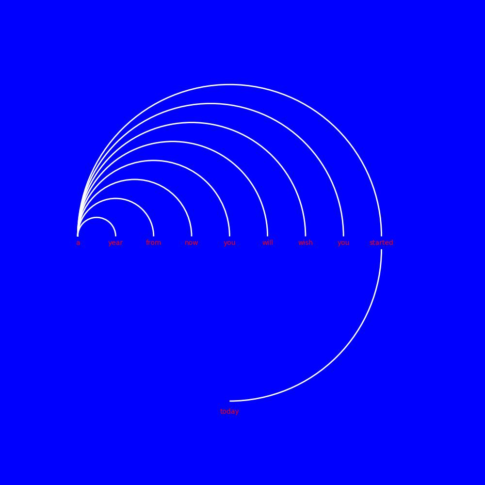

# HalfCircleText

## Idea

I came across a piece of concept art that wasn't particularly well done, lacking proper alignment and neatness. This inspired me to challenge myself and see if I could create something similar but with significant improvements. I aimed to make it neater, cleaner, and be able to replace the words with my own, while also providing the flexibility to change colors, all using Python. This way, the process could yield predictable and standardized outcomes compared to someone drawing it freehand on Photoshop or other software.

## Arc Versions

Each version of the program builds upon the previous one, striving to become better and more flexible.

V1-V5: Each version introduces additional features and improvements.

V5 (Current Version): The version I am currently working on has more customizable color selections and a cleaner input selection compared to the previous versions.

V6 - minor tweak
V7 - update to color choices and Capitalization of every first word choice button.

## Triangle Verions

Each version of the program builds upon the previous one, striving to become better and more flexible.

tri.py
triv2.py
triv2_1.py - text input box
tirv3.py - better text input plus color selection. png output
triv4.py - font choices and jpg output

