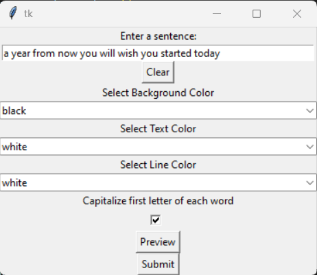
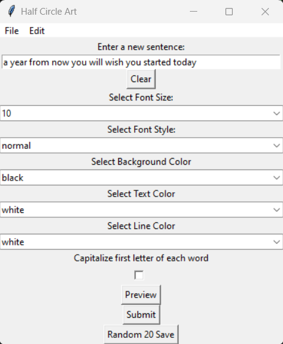
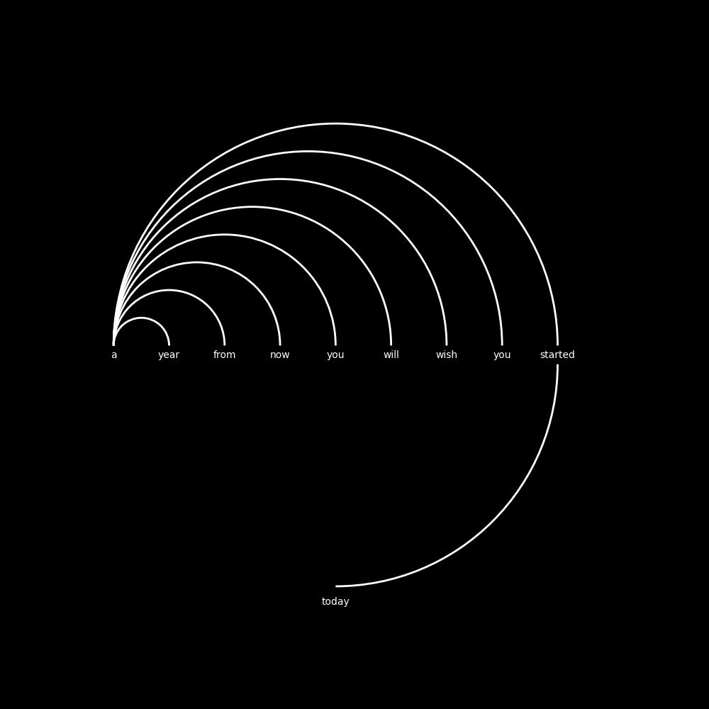
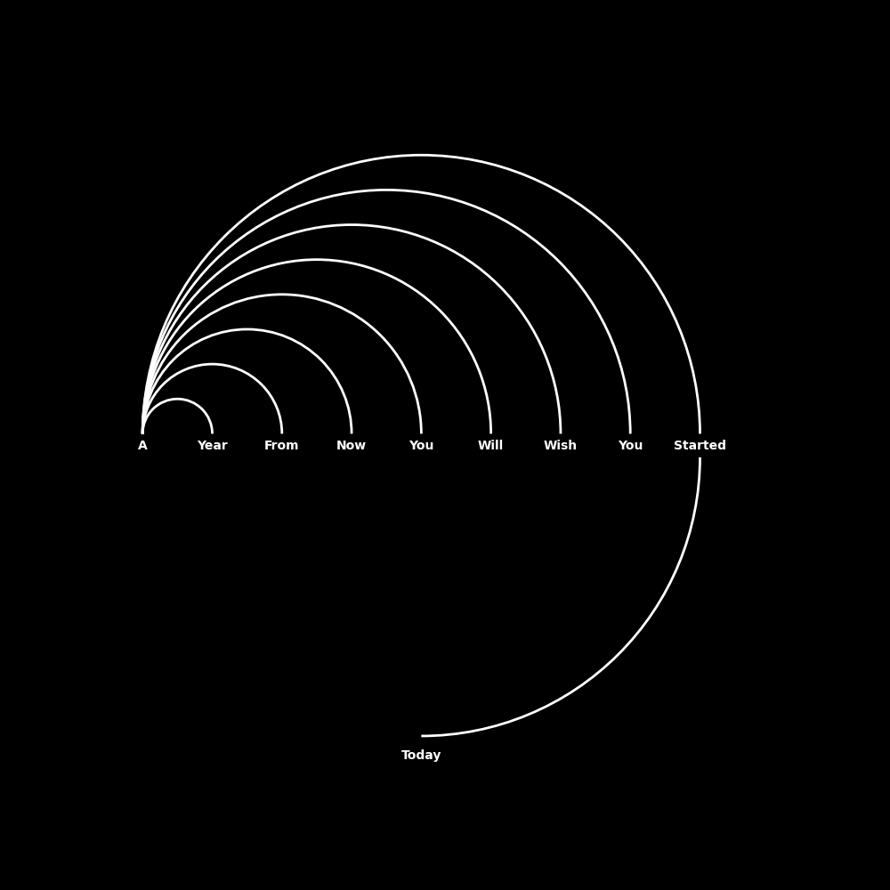
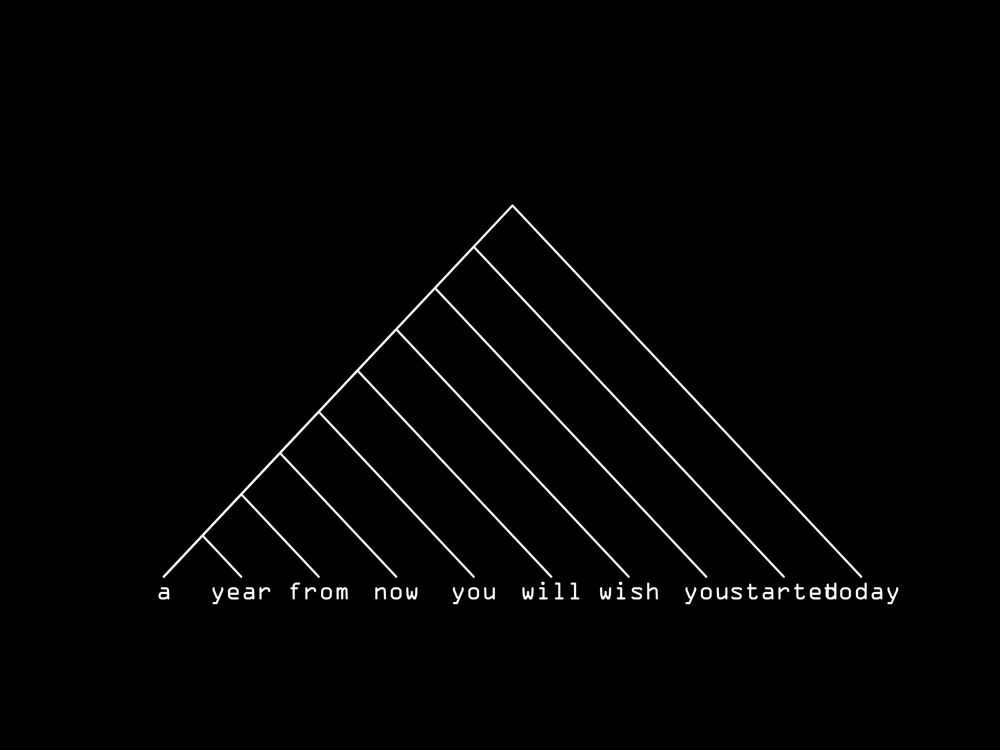

# HalfCircleText

## Concept:

Inspired by a piece of concept art that lacked alignment and neatness, I took up the challenge to create an improved version using Python. The objective was to make it neater, cleaner, and customizable. This tool allows the user to replace the words with their own and offers flexibility in color selection. The advantage of using Python for this task is the capability to produce predictable and standardized outcomes as opposed to freehand drawings on software like Photoshop.

## V10 UI:

## V12 UI:

## HOW TO USE: ##

**Enter a Sentence:** - Enter a sentence you would like displayed.

**Background Color/Text Color/Line Color** - select from 70 different colors for your message display.

**Capitalize first letter of each word** - Will automatically format your text to capital letters first on this selection.

**Preview** - Button allows to see a full screen image of the previous selections. If happy with this proceed to Submit to save.

**Submit** - Opens up a save file box to save anywhere on your computer for later use/viewing in JPG 600 DPI format. 

## Arc Versions:

Every iteration of the program introduces added features and enhancements, with each version building on the previous one.

**V1-V7:** Each version introduces additional features and improvements.

**V5** - This version has more customizable color selections and a cleaner input selection compared to the previous versions.

**V6** - This version includes minor tweaks.

**V7** (Current Version) - This version provides updates to color choices and introduces a feature to capitalize the first letter of every word.

**V8** - Update to system compatibility. Dual windows are open. Program properly terminates when the main GUI window closes. Elimianted the problem with spaces between word interupting output. Only words will have lines drawn to them.

**V9** - Save only Version. No preview.

**V10** - Updated UI / Updated Output with higher quality output of images/Preview/Save options.

## Current Final Version 12:

**V12** - Updated UI / Updated Output with options with fonts sizes and font style (bold, italic etc.)
        - Option to Randomly generate 20 color options and save them to Random folder.

## Triangle Versions:

Similar to the arc versions, each iteration of the Triangle Version program builds upon the previous one, making it better and more flexible.

tri.py
triv2.py
triv2_1.py - This version introduces a text input box.
triv3.py - This version enhances text input and introduces color selection. The output is in PNG format.
triv4.py - This version introduces font choices and outputs in JPG format. The font choices still have to be confirmed, currently, they are random.

## Designer:
Richard Malolepszy